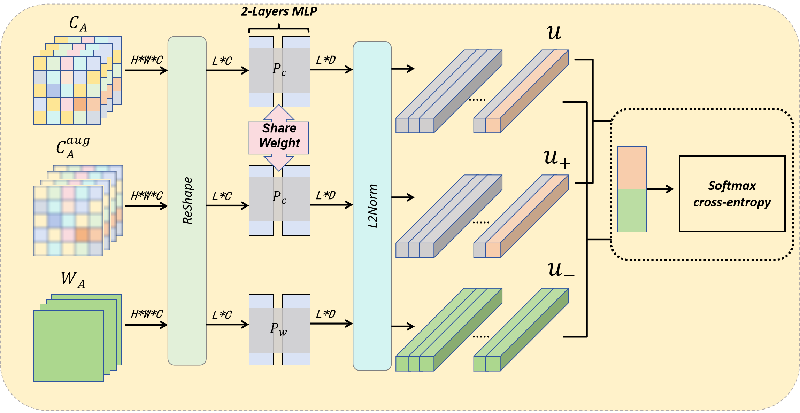

# UDUIE: Unpaired Domain-Irrelevant Underwater Image Enhancement（PRICAI2024）

 [](https://link.springer.com/chapter/10.1007/978-981-96-0125-7_17)

> Underwater image enhancement is fundamental to ocean exploration, as it can reduce the distortion caused by refraction and absorption in underwater imaging. Although many deep-learning-based underwater image enhancement methods achieved good performance based on multiple paired datasets, these methods can easily suffer from domain shifts and thus exhibit poor generalization to unfamiliar waters. In this work, we report a novel unpaired domain-irrelevant underwater image enhancement framework termed Unpaired Domain-Irrelevant Underwater Image Enhancement (UDUIE), with a domain-irrelevant loss built upon contrastive learning. The framework enhances domain generalization capability by transforming sample features and separating content features from water features in degraded photographs. Furthermore, we also propose a real-world, large-scale underwater image dataset (RLUI) in which degraded and clear domain images originate from existing photos, containing 7127 degraded images and 5644 clear images. Extensive experiments demonstrate that our approach outperforms current state-of-the-art methods in underwater image enhancement tasks across different underwater datasets.

<p align="center">

<br></p>

<p align="center">

<br>
    Visual results of UDUIE
</p>

<p align="center">

<br>
</p>

<p align="center">

<br>
    UDUIE applies Domain-Irrelevant loss to filter content for contrastive learning in underwater image enhancement task
</p>

## Getting Started

### Prerequisites

- Ubuntu 18.04
- NVIDIA GPU + CUDA CuDNN
- Python 3
	Please use `pip install -r requirements.txt` to install the dependencies.

## Datasets

### RLUI Dataset

you can get RLUI from [Baidu Netdisk](https://pan.baidu.com/s/1eT6Ky7hFzVDbb40lhuXuzw?pwd=cvpr)

### Other Datasets

you can get other datasets used in UDUIE from [Baidu Netdisk](https://pan.baidu.com/s/15wByLLGj6KKUQ0MsuiFvhA?pwd=cvpr)

## Pretrained Models

you can get pretrained model for RLUI dataset from [Baidu Netdisk](https://pan.baidu.com/s/1rUqGlU4rnaaqP3JgiAAn-Q?pwd=cvpr)

## Training

- Train the model:

```python
python train.py --dataroot=./RLUI/ --name=water
```

## Inference

- Test the model:

```python
python test.py --dataroot=./RLUI/ --name=water
```

- Or you can test the model with multiprocessing for faster testing:

```python
python test_multiprocess.py --dataroot=./RLUI/ --name=water
```

## Metrics

- None-reference metrics test

```python
python utils/uiqm_batch.py #(uiqm uciqe entropy)
```

```python
python utils/uranker_test.py #(uranker)
```

- Full-reference metrics test

```python
python utils/psnr_batch.py #(psnr mse)
```

## Citation

If you use this code for your research, please cite

```
@inproceedings{luo2024uduie,
  title={UDUIE: Unpaired Domain-Irrelevant Underwater Image Enhancement},
  author={Luo, Han and Han, Lu and Yu, Zhibin},
  booktitle={Pacific Rim International Conference on Artificial Intelligence},
  pages={202--214},
  year={2024},
  organization={Springer}
}
```

